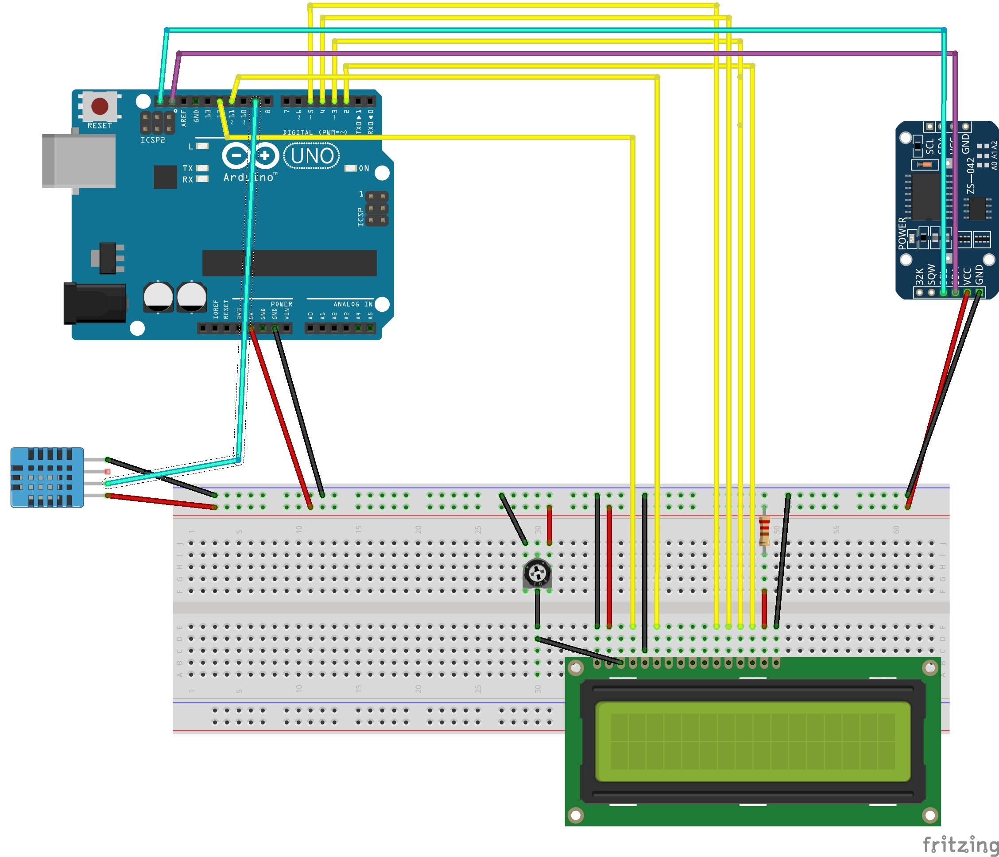
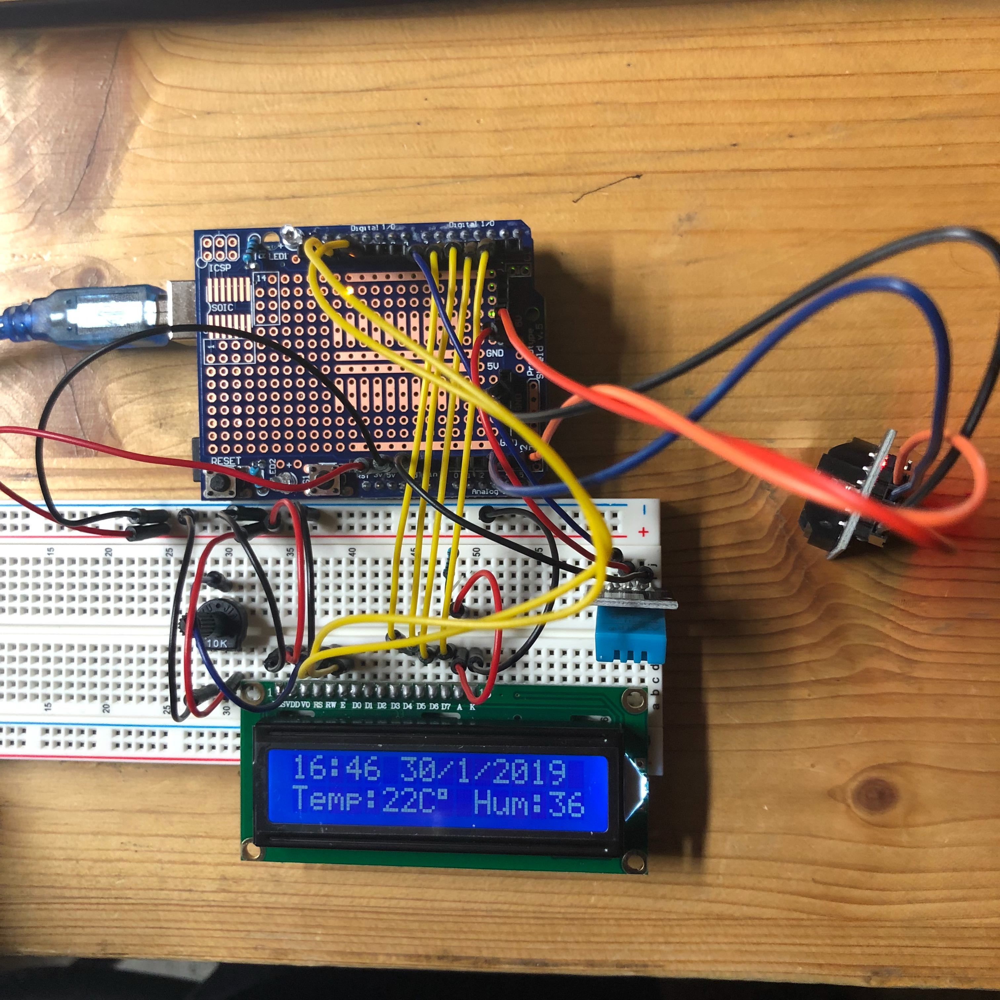

# stationmeteo

Afficheur heure, date, température, humidité 

Ce projet à été réalisé par [@siham](https://github.com/siham87) et [@wildcat](https://github.com/wildcat7534)

## Video :
[](https://www.youtube.com/watch?v=Gx60-Ce6xBY)


## **Bibliothéque utilisée**
+ Ecran lcd : [LiquidCrystal](https://www.arduino.cc/en/Tutorial/LiquidCrystalDisplay)
+ Capteur de témpérature : [DHT-sensor-library](https://github.com/adafruit/DHT-sensor-library)
+ Horloge : [Rtc by Makuna](https://github.com/Makuna/Rtc)

## **Matériel**
+ Arduino
+ Ecran LCD
+ Capteur de temperature
+ Horloge Rtc

## **Montage**



## **Code**

```
#include <DHT.h>
#include <Wire.h>
#include <RtcDS3231.h>
#include <Adafruit_Sensor.h>
#include <LiquidCrystal.h>
DHT dht(7, DHT11);

LiquidCrystal lcd(12, 11, 5, 4, 3, 2);
RtcDS3231<TwoWire> clock(Wire);

void setup() {

  lcd.begin(16 , 2);
  dht.begin();
  clock.Begin();
}

void loop() {


  lcd.setCursor(0, 0);
  RtcDateTime now = clock.GetDateTime();
  int temperature = dht.readTemperature();
  int humidity = dht.readHumidity();


  lcd.print(now.Hour());
  lcd.print(":");
  lcd.print(now.Minute());
  lcd.print(" ");
  lcd.print(now.Day());
  lcd.print("/");
  lcd.print(now.Month());
  lcd.print("/S");
  lcd.print(now.Year());
  lcd.print(" ");
  lcd.setCursor(0, 1);
  lcd.print("Temp:");
  lcd.print(temperature);
  lcd.print("C");
  lcd.print((char)223);
  lcd.print(" ");
  lcd.print("Hum:");
  lcd.print(humidity);
  lcd.print("%");

}
```


